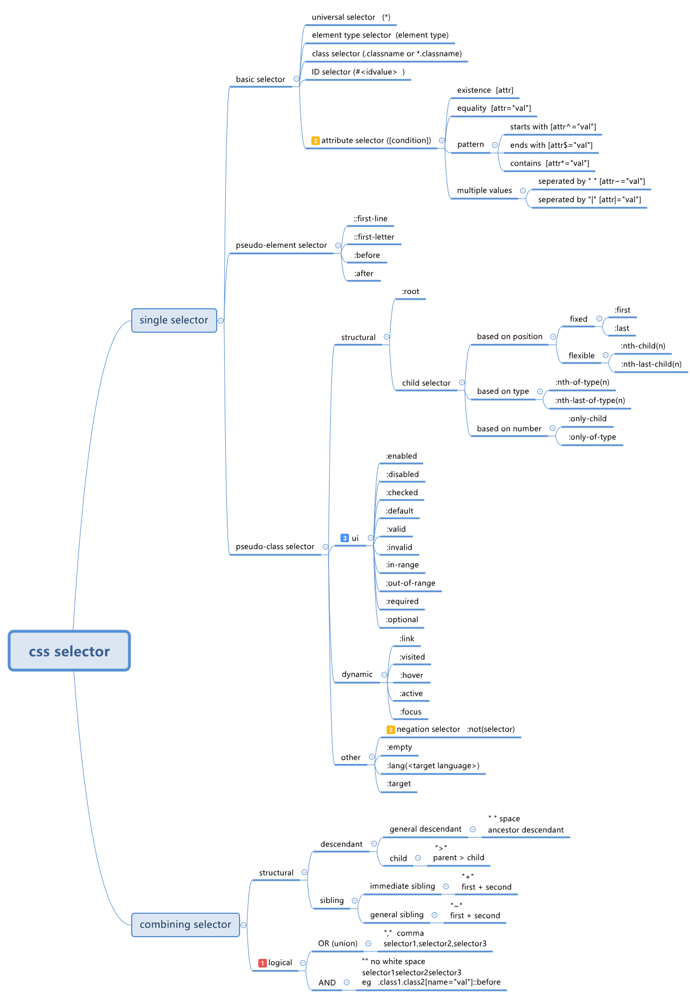

# What is a CSS selector for?
CSS selectors is used to identify which elements you want to apply a style to when using the style element or an external stylesheet.

# CSS selectors
The following svg shows these css selectors.

