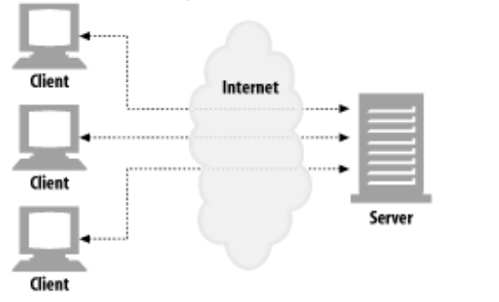
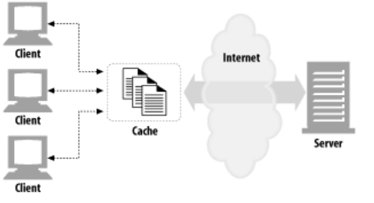
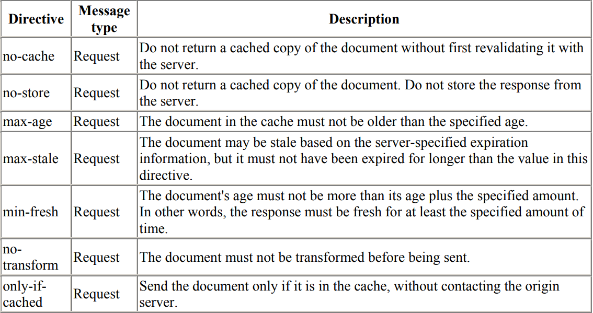
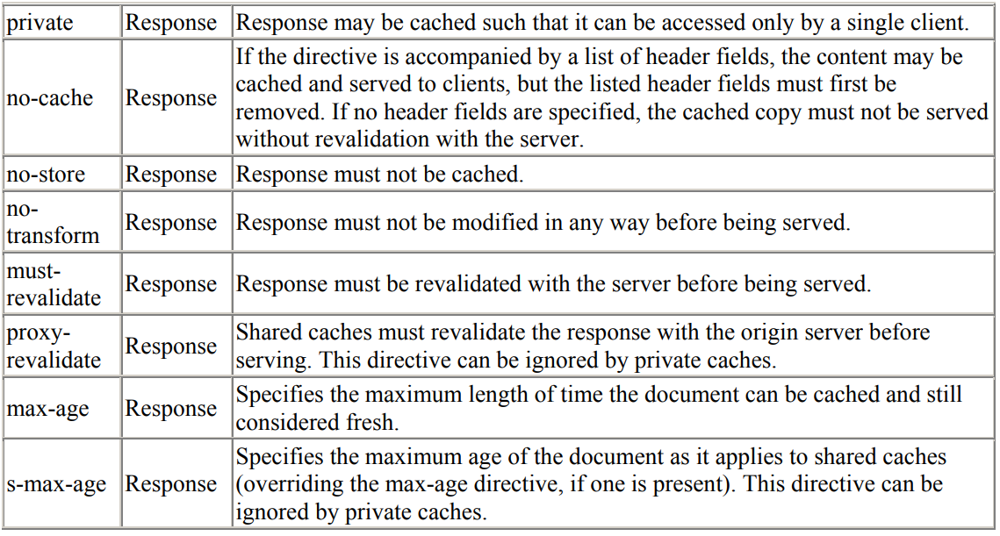
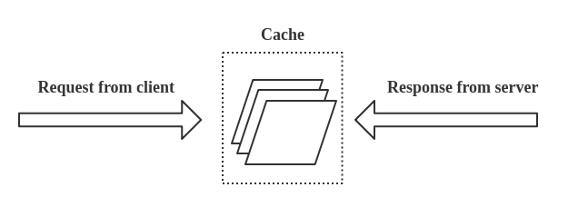
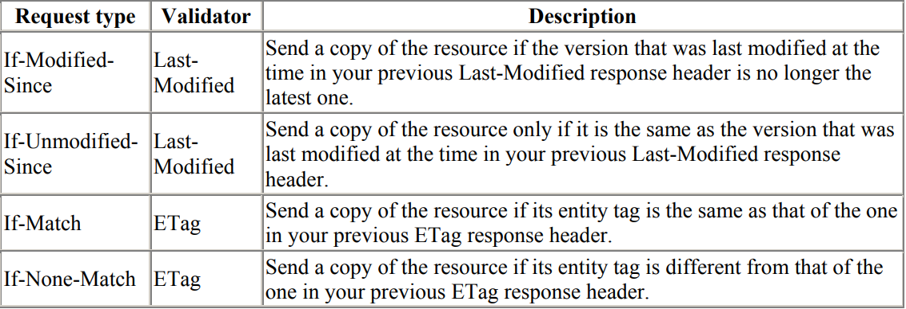
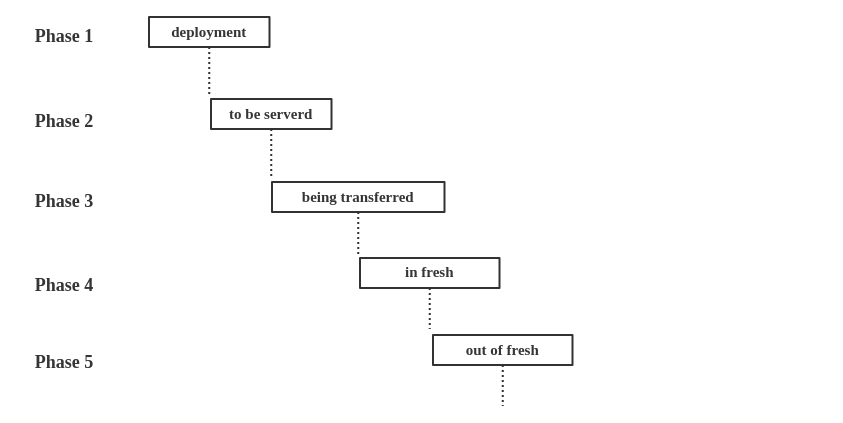

## HTTP Caching

The performance of web sites and applications can be significantly improved by reusing previously fetched resources. Web caches reduce latency and network traffic and thus lessen the time needed to display a representation of a resource. By making use of HTTP caching, Web sites become more responsive.
> The key theme of http caching should be **REUSE** previously fetched resources whenever is possible.

## Different kinds of caches

There are several kinds of caches: these can be grouped into two main categories: private or shared caches. A ***shared cache*** is a cache that stores responses for reuse by more than one user. A ***private cache*** is dedicated to a single user.

#### Private browser caches

A private cache is dedicated to a single user. You might have seen "caching" in your browser's settings already. A browser cache holds all documents downloaded via HTTP by the user. This cache is used to make visited documents available for ***back/forward navigation***, ***saving***, ***viewing-as-source***, etc. without requiring an additional trip to the server. It likewise improves offline browsing of cached content.



#### Shared proxy caches

A shared cache is a cache that stores responses to be reused by more than one user. For example, an ISP or your company might have set up a web proxy as part of its local network infrastructure to serve many users so that popular resources are reused a number of times, reducing network traffic and latency.




## Freshness

***Servers*** are expected to give clients information about how long clients can cache their content and consider it fresh. Servers can provide this information using one of two headers: 
- Expires
- Cache-Control

The ***Expires header*** specifies the ***exact data and time*** when the document ***"expires"*** -- when it can no longer be considered fresh. The syntax for the Expires header is:
```
Expires: Fri, 22 Jul 2018, 22:00:00 GMT 
```

> For a client and server to use the Expires header correctly, their clocks must be ***synchronized***. This is not always easy, because neither may run a clock synchronization protocol such as the Network Time Protocol (NTP).  A mechanism that defines expiration using ***relative time*** is more useful. 

 The ***Cache-Control header*** can be used to specify the maximum age for a document in seconds—the total amount of time since the document left the server. Age is not dependent on clock synchronization and therefore is likely to yield more accurate results. 


The Cache-Control header actually is very powerful. It can be used by both ***servers*** and ***clients*** to describe **freshness** ```using more directives than just specifying an age or expiration time```.  


The directives specify behavior intended to prevent **caches** from adversely interfering with the ***request*** or ***response***.
> Specify behavior that the caches MUST obey. 

These directives typically override the ***default caching algorithms***. Cache directives are ***unidirectional*** in that the presence of a directive in a request does not imply that the same directive is to be given in the response.



------




------




##  Conditionals and Validators

When a cache's copy is requested, and it is no longer fresh, the **cache** needs to make sure it has a fresh copy. The cache can fetch the current copy from the origin server, but in many cases, the document on the server is still the same as the stale copy in the cache. 

The cached copy may have expired, but the server content still is the same as the cache content. If a cache always fetches a server's document, even if it's the same as the expired cache copy, the cache wastes network bandwidth, places unnecessary load on the cache and server, and slows everything down. 

To fix this, HTTP provides a way for clients to request a copy ***only if the resource has changed***, using special requests called **conditional requests**.

Each conditional works on a particular **validator**. A validator is a particular ***attribute** of the ***document instance*** that is tested. 



### weak validators and strong validators

HTTP groups validators into two classes: ***weak validators*** and ***strong validators***. Weak validators may
not always ```uniquely identify an instance of a resource```; strong validators must.


##### Entity tags 

Entity tags are arbitrary labels (quoted strings) attached to the document.  	They might take the following form: 
- a serial number or version name for the document.
- a checksum or other fingerprint of the document content. 

#####  Why need Entity Tag Revalidation

There are some situations when the ***last-modified date revalidation*** is inadequate: 
- Some documents may be rewritten periodically (e.g., from a background process) but actually often contain the same data. The modification dates will change, even though the content hasn't. 
> Modification dates changes but not the content

- Some documents may have changed, but only in ways that aren't important enough to warrant caches worldwide to reload the data (e.g., spelling or comment changes). 
> Trivial changes

- For servers that serve documents that change in sub-second intervals (e.g. real-time monitors), the one-second granularity of modification dates might not be adequate. 
> Granularity 

#####  When to Use Entity Tags and Last-Modified Dates

- HTTP/1.1 clients must use an entity tag validator if a server sends back an entity tag.
- If the server sends back only a Last-Modified value, the client can use If-Modified-Since validation. 
- If both an entity tag and a last-modified date are available, the client should use both revalidation schemes.
> Allowing both HTTP/1.0 and HTTP/1.1 caches to respond appropriately. The **last-modified** works in  HTTP/1.0.

For example: 
- The response header

- The corresponding request header


## Defining optimal Cache-Control policy


Follow the decision tree above to determine the optimal caching policy for a particular resource, or a set of resources, that your application uses. Ideally, you should aim to cache as many responses as possible on the client for the longest possible period, and provide validation tokens for each response to enable efficient revalidation.

## Compliance

- The ***Cache-Control: max-age*** overrides the ***Expires date***.
- **HTTP/1.0** `caches` might not implement ***Cache-Control*** and might only implement **Pragma**: ***no-cache***.
-  If an old server that doesn't recognize the If-Modified-Since header gets the conditional request, it interprets it as a normal GET. 


## Caching checklist

There's no one best cache policy. Depending on your traffic patterns, type of data served, and application-specific requirements for data freshness, you must define and configure the appropriate per-resource settings, as well as the overall "caching hierarchy."

Some tips and techniques to keep in mind as you work on caching strategy:
- Use consistent URLs  (**Phase 2**)

> If you serve the same content on different URLs, then that content will be fetched and stored multiple times. And note that URLs are case sensitive.

- Ensure that the server provides a validation token  (**Phase 5**)
> Validation tokens (ETag) eliminate the need to transfer the same bytes when a resource has not changed on the server when modification data changes.

- Identify which resources can be cached by intermediaries  (**Phase 3**)
>  Those with responses that are identical for all users are great candidates to be cached by a CDN and other intermediaries.

- Determine the optimal cache lifetime for each resource  (**Phase 4**)
> Different resources may have different freshness requirements. Audit and determine the appropriate max-age for each one.

- Minimize churn (**Phase 1**)
> Some resources are updated more frequently than others. If there is a particular part of a resource (for example, a JavaScript function or a set of CSS styles) that is often updated, consider delivering that code as a separate file. 
> Doing so allows the remainder of the content (for example, library code that doesn't change very often), to be fetched from cache and minimizes the amount of downloaded content whenever an update is fetched.



																									
## References
- [HTTP Caching](https://developers.google.com/web/fundamentals/performance/optimizing-content-efficiency/http-caching)
- [MDN Cache](https://developer.mozilla.org/en-US/docs/Web/HTTP/Caching)
- [HTTP The Definitive Guide](http://www.staroceans.org/e-book/O%27Reilly%20-%20HTTP%20-%20The%20Definitive%20Guide.pdf)
- [Caching Tutorial](https://www.mnot.net/cache_docs)
- [HTTP Protocols](https://www.w3.org/Protocols/rfc2616/rfc2616-sec14.html#sec14.9.1)
