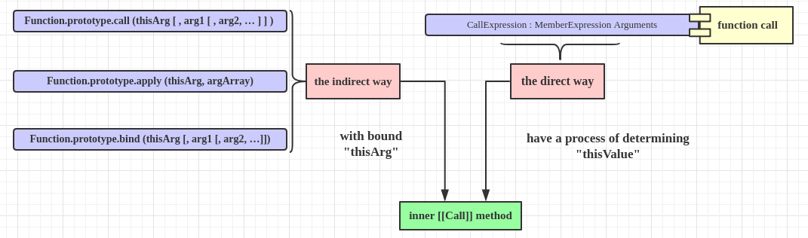

## Function calls

The production CallExpression : MemberExpression Arguments is evaluated as follows:

1. Let ***ref*** be the result of `evaluating` ***MemberExpression***.
2. Let ***func*** be ***GetValue(ref)*** .
> Steps 1 and 2: get the value of  ***func***.

3. Let ***argList*** be the result of `evaluating` ***Arguments***, producing an internal list of argument values.

4. If Type(***func***) is not Object, throw a TypeError exception.
5. If IsCallable(***func***) is false, throw a TypeError exception.
> Steps 4 and 5: ensure that ***func*** is a function object.

6. If Type(***ref***) is **Reference**, then
    1. If ***IsPropertyReference(ref)*** is true, then 
        1. Let ***thisValue*** be ***GetBase(ref)*** .
    2. Else, the base of ref is an ***Environment Record***
        1. Let ***thisValue*** be the result of calling the ***ImplicitThisValue*** concrete method of ***GetBase(ref)*** .
        > Declarative Environment Record alaways returns **undefined**, but Object Environment Record can be configured to return non undefined value. [More details](../../reference_specification_type.md).
7. Else, Type(***ref***) is not **Reference**.
   1. Let ***thisValue*** be **undefined**.
   > For example `(f = foo.bar)()`, where the left part is not a ***Reference*** but a actual value -- Function object. [More details](../../reference_specification_type.md).
   
> Steps 6 and 7: set the ***thisValue***.

8. Return the result of calling the ***[[Call]]*** internal `method` on ***func***, providing ***thisValue*** as the this value and providing the list ***argList*** as the argument values.
> Step 8: call the ***[[Call]]*** internal method.

## Two ways to call a function

Given a function **func**, as far as the determination of **this** concerned, there are basically two ways to have ***func*** called: 

- calling directly
> Normal function call, a process of determining the value of **this** is needed.

- calling indirectly
> Using `Function.prototype.call`, `Function.prototype.apply`, `Function.prototype.bind` and so on. In this way, the value of **this** is given directly, no intermediary process for determining the value of **this**.

## Caveats

You may heard about **value** or **reference** type for a ***variable***, but **Reference** here is not for variable, it is for a ***resolved name binding***.
