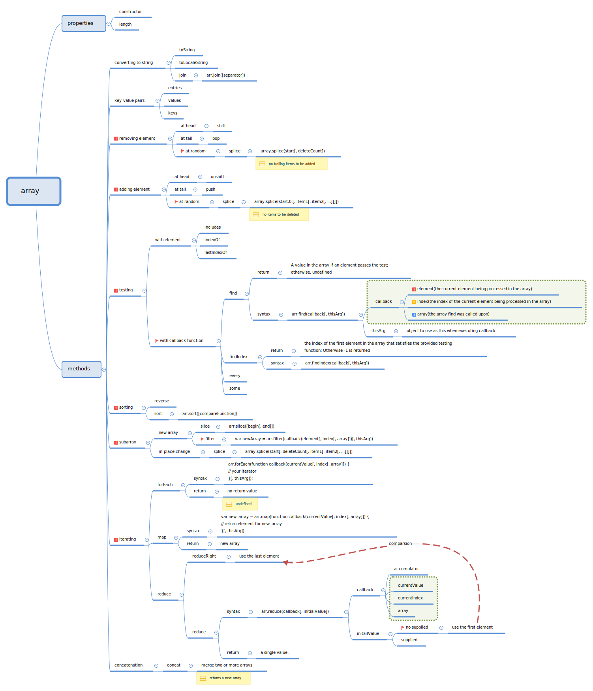

## Caveats

- The splice function exerts an effect of in-place change on an array 
```javascript
  var array = [1,2,3,4]
  var deletedArray = array.splice(0,2)
  // deletedArray -> [1,2]
  // array -> [3,4]
```
