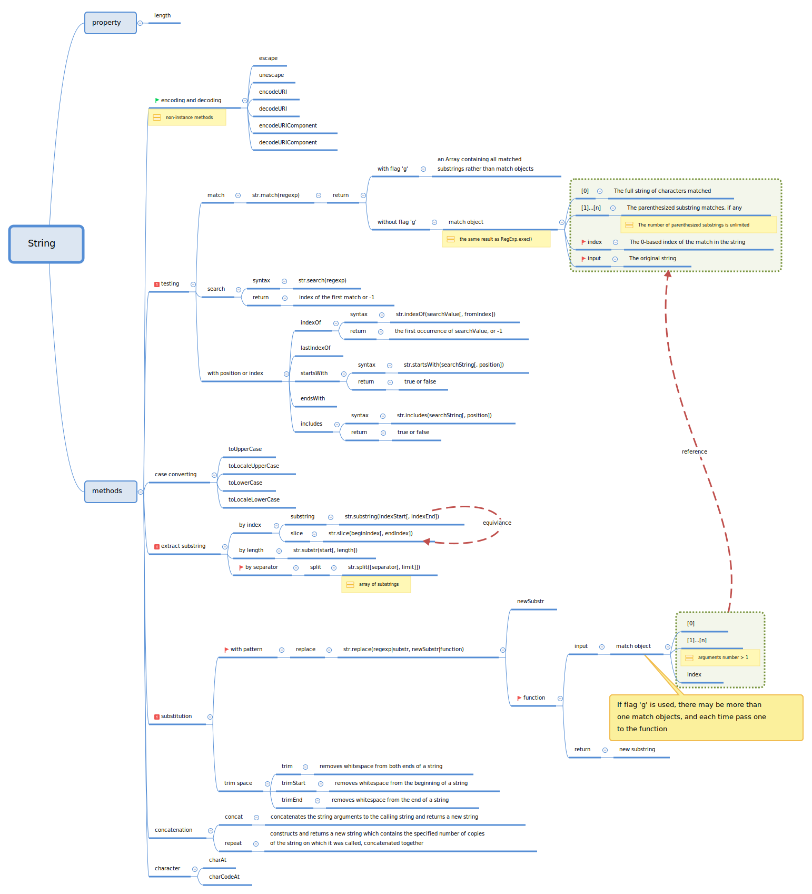

## Caveats

- The **match** function returns different type of result depending on whether there is a `g` flag in regular expression or not.
```javascript

   var string = "repeat  repeat repeat repeat"
   var regexp = /repeat/       // without `g` flag
   string.match(regexp)
   // ["repeat", index: 0, input: "repeat  repeat repeat repeat", groups: undefined]  // Object
   
   regexp = /repeat/g         // with `g` flag
   string.match(regexp)
   //  ["repeat", "repeat", "repeat", "repeat"]  // Array
```
